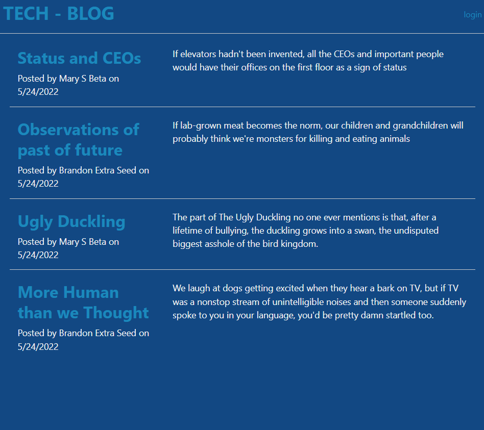
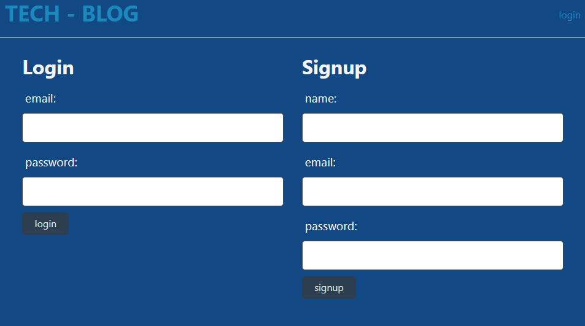
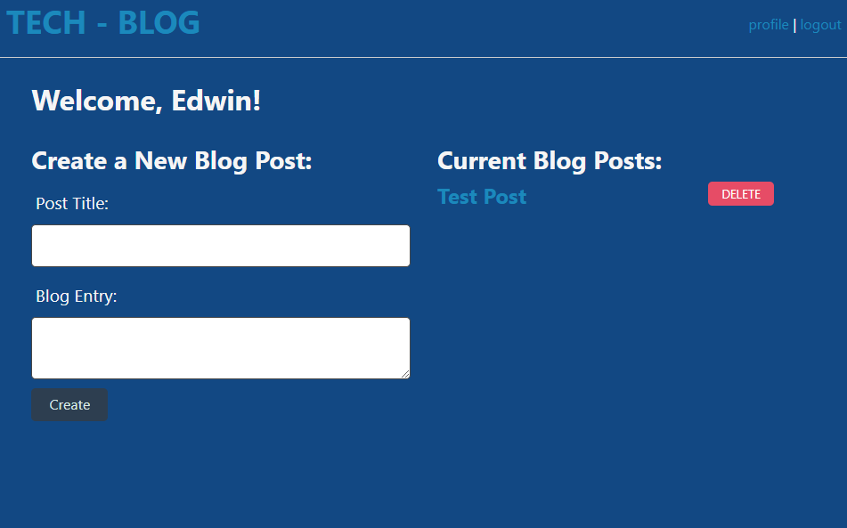
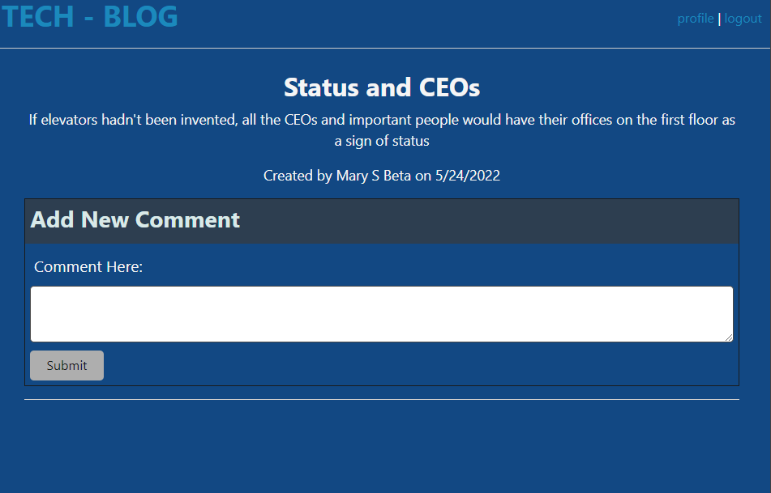

# TECH BLOG SITE

## About
This app is a tech blog that allows for registered users to post their thoughts and comments freely. All the users' blog post are shown on the homepage and can be viewed and commented on by anyone.

## How to Use

The app can be accessed on https://edwin-tech-blog.herokuapp.com/

The homepage of the website shows all the blog entries of all users.

To login or create a new account, click on the 'login' button on the top right of the screen. You will be shown options to either login or create an account. You will register a new account using email.

Once you have logged in, you will be redirected to your profile page which will show all of you blog posts as well as an area to post a new blog. You can also delete any of your blog posts here.

Finally, when clicking on a blog post, you can view it and any information about the post including the user to posted and the post date. Comments can also be added if you are logged into an account.

## Questions 

  Please send any questions by email to edwinfame@yahoo.com. 

  Or contact me via github.
  Github https://github.com/Famesmyname/Tech-Blog-Site.

## Credits
- Herokuapp.com for deployment and JAWSDB for database management

## Version History
-   0.90    Basic MVC File structure
-   1.00    MVP with user logins, and blog posting
-   1.01    Added blog deleting and updating homepage
-   1.02    Added commenting
-   1.03    Commenting made available only if logged in

            
## License
 
Copyright (C) 2022  Edwin Fame

Permission is hereby granted, free of charge, to any person obtaining a copy
of this software and associated documentation files (the "Software"), to deal
in the Software without restriction, including without limitation the rights
to use, copy, modify, merge, publish, distribute, sublicense, and/or sell
copies of the Software, and to permit persons to whom the Software is
furnished to do so, subject to the following conditions:

The above copyright notice and this permission notice shall be included in all
copies or substantial portions of the Software.

THE SOFTWARE IS PROVIDED "AS IS", WITHOUT WARRANTY OF ANY KIND, EXPRESS OR
IMPLIED, INCLUDING BUT NOT LIMITED TO THE WARRANTIES OF MERCHANTABILITY,
FITNESS FOR A PARTICULAR PURPOSE AND NONINFRINGEMENT. IN NO EVENT SHALL THE
AUTHORS OR COPYRIGHT HOLDERS BE LIABLE FOR ANY CLAIM, DAMAGES OR OTHER
LIABILITY, WHETHER IN AN ACTION OF CONTRACT, TORT OR OTHERWISE, ARISING FROM,
OUT OF OR IN CONNECTION WITH THE SOFTWARE OR THE USE OR OTHER DEALINGS IN THE
SOFTWARE.